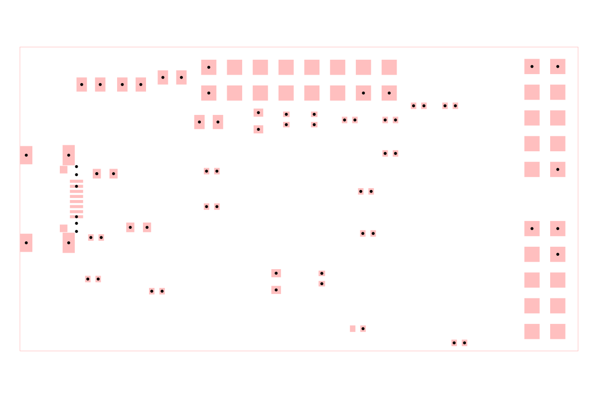

# dataset-srj10

A synthetic four-layer XU208 USB audio-interface routing problem. The board is
made up of a USB-C receptacle, XMOS XU208 processor, QSPI boot flash, 24 MHz
oscillator, 3.3 V and 1.0 V regulators, decoupling, reset/JTAG support, and
audio-oriented I/O on a compact 55 mm × 30 mm PCB.

## Example

`samples/sample001-xmos-usb-audio.srj.json` is generated from the tscircuit
source with routing disabled. The image below is then generated by constructing
an `AutoroutingPipelineSolver`, calling `.visualize()`, and converting the
graphics object to SVG with `graphics-debug`.

Regenerate both assets with `bun run generate:catalog-assets`.

## Browse and deploy

Run `bun run cosmos` for the React Cosmos catalog. `bun run build:site` exports
it to `cosmos-export/`, the output directory configured for Vercel.
